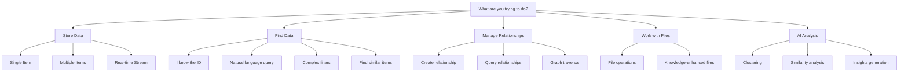

# 🧠 Brainy API Decision Tree

*Choose the right API for your use case with confidence*

This guide helps you navigate Brainy's comprehensive API surface by asking the right questions to find the perfect method for your specific needs.

## 🎯 Quick Start: What do you want to do?

### 📝 **Adding Data**
- **Single entity** → [`brainy.add()`](#adding-single-entities)
- **Multiple entities** → [`brainy.addMany()`](#adding-multiple-entities)
- **Streaming/real-time data** → [Streaming Pipeline](#streaming-data)

### 🔍 **Finding Data**
- **Natural language search** → [`brainy.find("search query")`](#natural-language-search)
- **Structured/filtered search** → [`brainy.find({ query, where, type })`](#structured-search)
- **Similar entities** → [`brainy.similar()`](#similarity-search)
- **Get by ID** → [`brainy.get()`](#retrieval-by-id)

### 🔗 **Relationships**
- **Create relationships** → [`brainy.relate()`](#creating-relationships)
- **Query relationships** → [`brainy.getRelations()`](#querying-relationships)
- **Graph traversal** → [Graph Navigation](#graph-operations)

### 📊 **Advanced Features**
- **File management** → [VFS (Virtual File System)](#file-operations)
- **AI-powered analysis** → [Neural API](#neural-analysis)
- **Clustering/insights** → [Intelligence Systems](#intelligence-systems)

---

## 🔀 Decision Tree Flow



---

## 📝 Adding Data

### Adding Single Entities

**Use `brainy.add()` when:**
- Adding one entity at a time
- You need the ID immediately for further operations
- Working with user input or real-time data

```typescript
// ✅ Perfect for single entities
const id = await brainy.add({
  data: "New research paper on quantum computing",
  type: NounType.Document,
  metadata: { category: "research", priority: "high" }
})
```

**Decision factors:**
- **Single item?** → `add()`
- **Need immediate ID?** → `add()`
- **Interactive application?** → `add()`

### Adding Multiple Entities

**Use `brainy.addMany()` when:**
- Bulk importing data
- Processing batches (>10 items)
- Performance is critical

```typescript
// ✅ Perfect for bulk operations
const result = await brainy.addMany({
  items: documents.map(doc => ({
    data: doc.content,
    type: NounType.Document,
    metadata: doc.metadata
  })),
  chunkSize: 100,
  parallel: true
})
```

**Decision factors:**
- **Multiple items (>10)?** → `addMany()`
- **Batch processing?** → `addMany()`
- **Can tolerate some failures?** → `addMany()` with `continueOnError: true`

### Streaming Data

**Use Streaming Pipeline when:**
- Real-time data ingestion
- Processing large datasets that don't fit in memory
- Need transformation during ingestion

```typescript
// ✅ Perfect for streaming
const pipeline = brainy.streaming.pipeline()
  .transform(data => ({ ...data, processed: true }))
  .batch(50)
  .into(brainy)
```

---

## 🔍 Finding Data

### Natural Language Search

**Use `brainy.find("query string")` when:**
- User is typing search queries
- You want semantic understanding
- Building search interfaces

```typescript
// ✅ Perfect for user searches
const results = await brainy.find("documents about machine learning")
```

**Decision factors:**
- **User-generated query?** → Natural language `find()`
- **Semantic understanding needed?** → Natural language `find()`
- **Search interface?** → Natural language `find()`

### Structured Search

**Use `brainy.find({ query, where, type })` when:**
- Complex filtering requirements
- Combining text search with metadata filters
- Performance-critical searches

```typescript
// ✅ Perfect for complex queries
const results = await brainy.find({
  query: "neural networks",
  type: NounType.Document,
  where: {
    status: "published",
    year: { $gte: 2020 }
  },
  limit: 20
})
```

**Decision factors:**
- **Need metadata filtering?** → Structured `find()`
- **Performance critical?** → Structured `find()`
- **Complex criteria?** → Structured `find()`

### Similarity Search

**Use `brainy.similar()` when:**
- Finding "more like this" content
- Recommendation systems
- Duplicate detection

```typescript
// ✅ Perfect for recommendations
const similar = await brainy.similar({
  to: "document-id-123",
  limit: 10,
  type: NounType.Document
})
```

**Decision factors:**
- **"More like this" feature?** → `similar()`
- **Recommendations?** → `similar()`
- **Duplicate detection?** → `similar()`

### Retrieval by ID

**Use `brainy.get()` when:**
- You know the exact ID
- Loading specific entities
- Following relationships

```typescript
// ✅ Perfect for direct access
const entity = await brainy.get("known-id-123")
```

**Decision factors:**
- **Known ID?** → `get()`
- **Direct access needed?** → `get()`
- **Following relationships?** → `get()`

---

## 🔗 Relationships

### Creating Relationships

**Use `brainy.relate()` when:**
- Connecting two entities
- Building knowledge graphs
- Modeling real-world relationships

```typescript
// ✅ Perfect for connections
await brainy.relate({
  from: "user-123",
  to: "project-456",
  type: VerbType.WorksOn,
  metadata: { role: "lead", since: "2024-01-01" }
})
```

**Decision factors:**
- **Connecting entities?** → `relate()`
- **Need relationship metadata?** → `relate()`
- **Building graphs?** → `relate()`

### Querying Relationships

**Use `brainy.getRelations()` when:**
- Finding all connections for an entity
- Exploring relationship patterns
- Building relationship views

```typescript
// ✅ Perfect for relationship queries
const relations = await brainy.getRelations({
  from: "user-123",
  type: VerbType.WorksOn
})
```

---

## 📁 File Operations

### Basic File Operations

**Use VFS when:**
- Managing files and directories
- Need hierarchical structure
- Building file explorers

```typescript
// ✅ Perfect for file management
const vfs = brainy.vfs({ storage: 'filesystem' })
await vfs.writeFile('/docs/readme.md', 'content')
const files = await vfs.getDirectChildren('/docs')
```

**Decision factors:**
- **File management?** → VFS
- **Directory structure?** → VFS
- **File explorer interface?** → VFS

### Knowledge-Enhanced Files

**Use VFS with Knowledge Layer when:**
- Need semantic file search
- Want AI-powered file insights
- Building smart file systems

```typescript
// ✅ Perfect for intelligent file systems
const knowledgeVFS = await vfs.withKnowledge(brainy)
const insights = await knowledgeVFS.getFileInsights('/project')
```

---

## 🧠 AI Analysis

### Clustering

**Use Neural API clustering when:**
- Discovering data patterns
- Organizing large datasets
- Creating automatic categories

```typescript
// ✅ Perfect for pattern discovery
const neural = brainy.neural()
const clusters = await neural.cluster({
  entities: entityIds,
  k: 5,
  method: 'hierarchical'
})
```

### Intelligence Systems

**Use Triple Intelligence when:**
- Complex multi-criteria searches
- Advanced relationship queries
- Performance-critical operations

```typescript
// ✅ Perfect for complex queries
const intelligence = brainy.getTripleIntelligence()
const results = await intelligence.query({
  vector: queryVector,
  metadata: { category: 'research' },
  graph: { connected: 'user-123' }
})
```

---

## 🚀 Performance Optimization Guide

### When Performance Matters

| Scenario | Best Choice | Why |
|----------|-------------|-----|
| **Bulk Import** | `addMany()` | Batched operations, parallel processing |
| **Metadata-only Search** | `find({ where: {...} })` | Skips vector computation |
| **Known ID Access** | `get()` | Direct index lookup |
| **Large Result Sets** | Pagination with `offset`/`limit` | Memory efficient |
| **Real-time Streams** | Streaming Pipeline | Memory efficient, scalable |

### Memory Usage Optimization

```typescript
// ❌ Memory intensive
const allResults = await brainy.find({ limit: 10000 })

// ✅ Memory efficient
for (let offset = 0; offset < total; offset += 100) {
  const batch = await brainy.find({
    query: "...",
    limit: 100,
    offset
  })
  await processBatch(batch)
}
```

---

## 🎯 Common Use Case Patterns

### Building a Search Interface

```typescript
// User types query → Natural language search
const searchResults = await brainy.find(userQuery)

// User applies filters → Structured search
const filteredResults = await brainy.find({
  query: userQuery,
  where: selectedFilters,
  type: selectedTypes
})

// User clicks "more like this" → Similarity search
const similar = await brainy.similar({ to: selectedId })
```

### Building a Recommendation System

```typescript
// 1. Get user's interaction history
const user = await brainy.get(userId)

// 2. Find similar users
const similarUsers = await brainy.similar({ to: userId, type: NounType.Person })

// 3. Get their liked content
const recommendations = []
for (const similarUser of similarUsers) {
  const relations = await brainy.getRelations({
    from: similarUser.id,
    type: VerbType.Likes
  })
  recommendations.push(...relations)
}
```

### Building a Knowledge Graph

```typescript
// 1. Add entities
const entities = await Promise.all([
  brainy.add({ data: "Person: Alice", type: NounType.Person }),
  brainy.add({ data: "Company: TechCorp", type: NounType.Organization }),
  brainy.add({ data: "Project: AI Assistant", type: NounType.Thing })
])

// 2. Create relationships
await brainy.relate({
  from: entities[0], // Alice
  to: entities[1],   // TechCorp
  type: VerbType.WorksFor
})

await brainy.relate({
  from: entities[0], // Alice
  to: entities[2],   // AI Assistant
  type: VerbType.WorksOn
})

// 3. Query the graph
const aliceConnections = await brainy.getRelations({ from: entities[0] })
```

---

## 🔧 Migration Guide

### From v2.x to v3.x APIs

| v2.x (Deprecated) | v3.x (Current) | When to Use |
|-------------------|----------------|-------------|
| `brain.store()` | `brainy.add()` | Adding entities |
| `brain.search()` | `brainy.find()` | Searching content |
| `brain.query()` | `brainy.find({ ... })` | Complex queries |
| `brain.similar()` | `brainy.similar()` | ✅ Same API |
| `brain.connect()` | `brainy.relate()` | Creating relationships |

### Legacy Type Migration

```typescript
// ❌ v2.x way
import { ISenseAugmentation } from '@soulcraft/brainy/types/augmentations'

// ✅ v3.x way
import { BrainyAugmentation } from '@soulcraft/brainy'
```

---

## 🎪 Decision Quick Reference

**Need to add data?**
- 1 item → `add()`
- Many items → `addMany()`
- Streaming → Pipeline

**Need to find data?**
- Know ID → `get()`
- Natural search → `find("query")`
- Complex filters → `find({ query, where })`
- Similar items → `similar()`

**Need relationships?**
- Create → `relate()`
- Query → `getRelations()`
- Complex graph → Triple Intelligence

**Need files?**
- Basic → VFS
- Smart → VFS + Knowledge Layer

**Need AI analysis?**
- Patterns → Neural clustering
- Complex queries → Triple Intelligence

---

*This guide covers 95% of use cases. For edge cases or custom requirements, check the [Core API Patterns](./CORE_API_PATTERNS.md) and [Neural API Patterns](./NEURAL_API_PATTERNS.md) guides.*